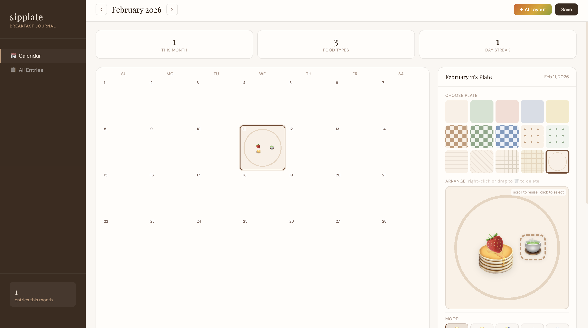

# SipPlate 🍳

A cross-platform desktop journaling app built around a visual breakfast plate designer. Arrange food emoji on a customizable plate, track your daily mood, write notes, and let Google Gemini AI design your plate based on how you feel.

Built with **React + Vite** on the frontend, **FastAPI** on the backend, and **Electron** wrapping everything into a native desktop app.



---

## Features

- **📅 Monthly calendar** — each day cell shows a live thumbnail of that day's plate
- **🍳 Plate designer** — drag food emoji freely, resize with scroll wheel or pinch-to-zoom
- **🎨 15 plate backgrounds** — solid colors, checks, dots, stripes, waffle, linen
- **😊 Mood tracker** — log your daily mood alongside your meal
- **✦ AI plate layout** — describe your mood or meal, Gemini 2.0 Flash picks food and arranges it
- **💾 Local persistence** — entries stored in localStorage (frontend) and backend/data/entries.json (API)
- **📊 Stats** — monthly entry count, unique food types, current day streak

---

## Project Structure

```
sipplate/
├── frontend/          React 18 + Vite 5 (UI)
│   └── src/
│       ├── App.jsx                  Main app, wires all views
│       ├── hooks/
│       │   ├── useEntries.js        localStorage persistence + streak logic
│       │   └── usePlateCanvas.js    Drag, drop, pinch-to-scale interactions
│       └── components/
│           ├── Calendar.jsx         Monthly grid with plate thumbnails
│           ├── PlateCanvas.jsx      Interactive plate designer canvas
│           ├── DayEditor.jsx        Right panel (plate + mood + notes)
│           ├── GeminiModal.jsx      AI layout via Gemini API
│           └── LogView.jsx          All entries list view
├── backend/           FastAPI + Uvicorn (REST API + JSON persistence)
│   ├── main.py        CRUD endpoints + stats
│   └── storage.py     JSON file read/write layer
└── desktop/           Electron 29 (native desktop wrapper)
    └── electron.js    Spawns backend process + loads frontend
```

---

## Quick Start

### 1. Frontend
```bash
cd frontend
npm install
npm run dev
# → http://localhost:5173
```

### 2. Backend
```bash
cd backend
pip install -r requirements.txt
uvicorn main:app --reload --port 8000
# → http://localhost:8000/docs
```

### 3. Desktop (optional)
```bash
cd desktop
npm install
npm run dev
```

---

## API Reference

| Method | Endpoint | Description |
|--------|----------|-------------|
| `GET` | `/api/entries` | All entries keyed by date |
| `GET` | `/api/entries/{date}` | Single entry (YYYY-MM-DD) |
| `PUT` | `/api/entries/{date}` | Save / update entry |
| `DELETE` | `/api/entries/{date}` | Delete entry |
| `GET` | `/api/stats` | Streak, total entries, unique foods |

### Entry shape
```json
{
  "foods": [{ "emoji": "🥞", "x": 45, "y": 50, "scale": 1.2 }],
  "bgId": "check-brown",
  "mood": "😊",
  "notes": "Great morning!",
  "saved": "2026-03-19T08:00:00"
}
```

---

## Tech Stack

| Layer | Technology |
|-------|-----------|
| Frontend | React 18, Vite 5 |
| Backend | FastAPI, Uvicorn, Pydantic |
| Desktop | Electron 29 |
| AI | Google Gemini 2.0 Flash |
| Persistence | localStorage (frontend) · JSON file (backend) |

---

## AI Layout

The Gemini integration takes a natural language description, sends it to gemini-2.0-flash with a structured system prompt specifying available emoji and plate backgrounds, and parses the JSON response into a full plate layout — positions as percentages, scale values, and a matching background. Bring your own Gemini API key.
